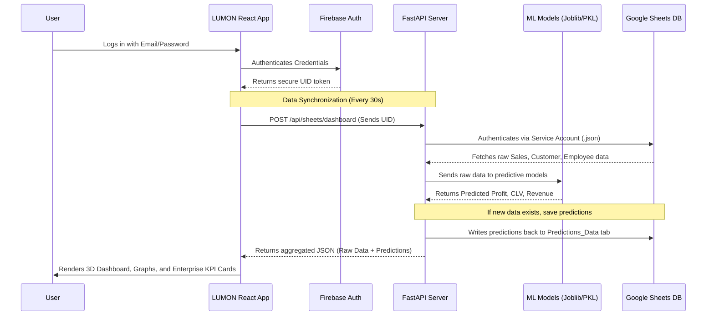

# LUMON Analytics - System Architecture & Workflow

This document outlines the end-to-end architecture and data workflow for the LUMON Analytics platform.

## Architecture Diagram

## System Components

### 1. Authentication Layer (Firebase)
Everything starts with **Firebase**. When a user logs in via the frontend, Firebase issues them a unique **UID**. This UID acts as the ultimate key for data isolation. Throughout the entire system, a user can only ever read, write, or predict data that is strictly tagged with their specific UID.

### 2. Presentation Layer (Vite + React)
Located in `nexus-analytics/`, the frontend acts exclusively as the presentation layer. It does **not** communicate directly with Google Sheets or run complex machine learning logic. Instead, it periodically pings the Python backend. Once it receives enriched data, it maps that data into the interactive Recharts graphs, KPI cards, and anomaly alerts on the executive dashboard.

### 3. API & Controller Layer (FastAPI Backend)
Located in `backend/`, this is the central nervous system of the operation. It has two main responsibilities:
*   **Secure Database Communication:** It uses the `service_account.json` file to securely talk to Google Sheets via the Google API. It fetches data, filters out everything that doesn't match the active user's UID, and formats it for the frontend.
*   **API Routing:** It provides clear, high-performance REST endpoints (like `/api/sheets/dashboard` and `/api/sheets/sync`) for the frontend to consume.

### 4. Artificial Intelligence Engine (Pre-trained ML Models)
Located in the `models/` folder, these are the pre-trained `scikit-learn` model files (`.pkl` and `.joblib`). When new data passes through the FastAPI backend during a sync event, the backend intercepts it. It feeds the raw metrics into Random Forest and Regression models to calculate **Predicted Revenue**, **Predicted Profit**, and **Customer Lifetime Value (CLV)**. 

### 5. Database Layer (Google Sheets)
Google Sheets acts as the cloud database. It is segmented into dedicated tables (`Sales_Data`, `Customer_Data`, `Employee_Data`, `Predictions_Data`). Not only does it store historical data, but the backend automatically writes the newly generated AI predictions back into the sheet, ensuring a permanent historical record of system forecasts and anomalies.

---

*In short: React handles the visuals, Firebase handles the security, FastAPI routes the traffic, Google Sheets handles data storage, and the ML models act as the oracle that predicts the future.*
